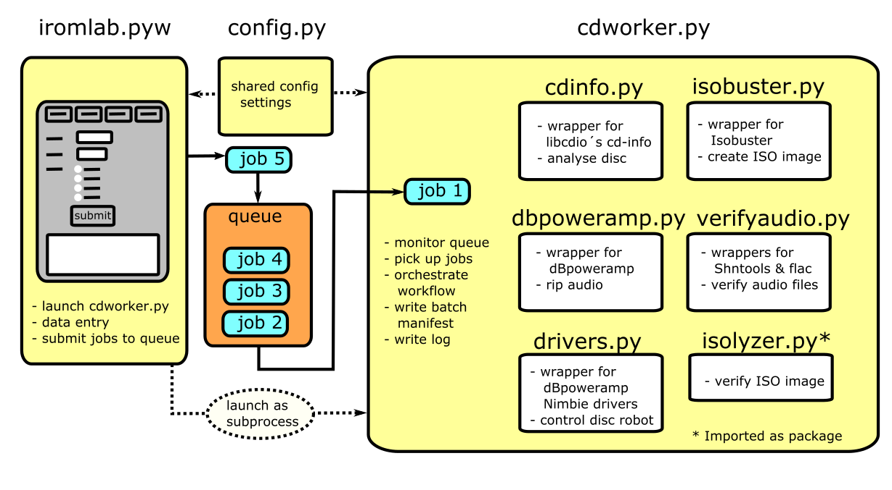

# Iromlab Architecture Overview

The following figure gives an overview of Iromlab's basic overview:

Iromlab's main modules are [*iromlab.pyw*](../iromlab/iromlab.pyw) and [*cdworker*](../iromlab/cdworker.py). 

## [Iromlab.pyw](../iromlab/iromlab.pyw)

This module contains all the code that defines Iromlab's graphical user interface. Upon startup it first reads the Iromlab configuration file. It then performs a number of checks on the configuration parameters (e.g. do the file paths correspond to files/directories that actually exist?), and sets up the batch directory. The main function of this module is to take care of all aspects related to data entry. For each disc, data that are entered by the operator (PPN, volume number, carrier type) are written to a file-based processing queue. This queue is implemented as a physical directory (named *jobs*) inside the batch. 

This module also launches *cdworker.py*.

## [Cdworker.py](../iromlab/cdworker.py)

This module is launched by [*iromlab.pyw*](../iromlab/iromlab.pyw) as a separate thread. It takes care of the actual processing of the discs. It does this by monitoring the processing queue. If the queue contains one or more job files, it picks the oldest job in the queue ("First In First Out"), and then loads the corresponding disc from the disc robot using the [*drivers.py*](../iromlab/drivers.py) module. This module contains wrapper functions for dBpoweramp's [drivers for the Nimbie disc robot](https://www.dbpoweramp.com/install/dBpoweramp-Batch-Ripper-Nimbie.exe). After loading, the disc is analysed with [*cdinfo.py*](../iromlab/cdinfo.py), which wraps around the [*cd-info*](https://linux.die.net/man/1/cd-info) tool. 

If a disc contains a data session, its contents are extracted to an ISO image using [*isobuster.py*](../iromlab/isobuster.py), which is a wrapper for [*Isobuster*](https://www.isobuster.com/). The ISO image is then verified using [*isolyzer*](https://github.com/KBNLresearch/isolyzer) (which is automatically installed during *Iromlab*'s setup).  

If the disc contains audio, the audio is ripped to WAV or FLAC using [*dbpoweramp.py*](../iromlab/dbpoweramp.py), which wraps around [*dBpoweramp*](https://www.dbpoweramp.com/). The audio is then verified using [*verifyaudio.py*](../iromlab/verifyaudio.py), which wraps around [*Shntool*](http://www.etree.org/shnutils/shntool/) and [*flac*](https://xiph.org/flac/).

