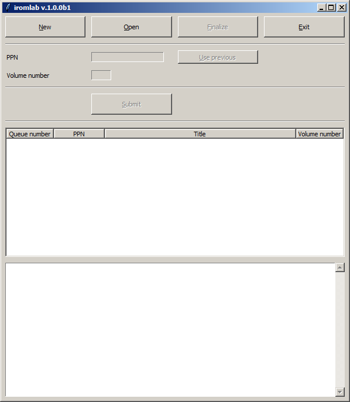
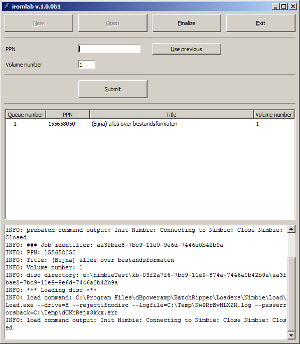

% Handleiding Workflow Optische Dragers
% Johan van der Knijff
% 21 mei 2019

# Over deze handleiding

Deze handleiding beschrijft de workflow voor het maken van disc images van optische dragers met de *Iromlab* software[^1]. Hierbij wordt verondersteld dat *Iromlab* en alle afhankelijkheden geïnstalleerd en geconfigureerd zijn. Raadpleeg de *Iromlab* Setup Guide[^2] als dit niet het geval is. Verder wordt verondersteld dat de *startOnFinalize* optie geactiveerd is.

[^1]: Iromlab: <https://github.com/KBNLresearch/iromlab>
[^2]: Iromlab Setup Guide: <https://github.com/KBNLresearch/iromlab/blob/master/doc/setupGuide.md>

# Voorbereiding

Zet vóór het opstarten van *Iromlab* altijd eerst de Nimbie discrobot aan, en wacht dan ongeveer 30 seconden (als je dit niet doet, bestaat de kans dat Iromlab de optische drive van de Nimbie niet herkent, met als resultaat een foutmelding). Dubbelklik nu op het *Iromlab* icoontje op de Desktop. Als alles goed gaat start Iromlab nu op met het volgende venster:

Je ziet nu bovenin drie grote knoppen, die overeenkomen met de volgende acties:

* *New*: maak een nieuwe batch (uitleg hieronder)
* *Open* open een bestaande batch
* *Exit*: sluit Iromlab af

# Nieuwe batch maken

Klik op de *New* knop linksboven. Iromlab bevestigt de aanmaak van de batch met het volgende dialoogvenster:

Klik deze melding weg met *OK*. De *Iromlab* interface ziet er nu als volgt uit: 

# Verwerking van de dragers

Voor elke drager moeten de volgende stappen doorlopen worden:

1. Haal de drager uit het doosje

2. Inspecteer de drager op de aanwezigheid van vuil. Blaas eventueel stof weg, en maak de drager zo nodig schoon. Gebruik hiervoor een met gedestilleerd water bevochtigd, niet-pluizend (microvezel)doekje. Voor hardnekkig vuil kan een alcoholoplossing worden gebruikt. Beweeg het doekje altijd in *rechte* bewegingen van de binnenkant van de drager naar de buitenkant.

3. Voer in de *Iromlab* interface de vereiste velden in voor deze drager:

    

* *PPN* is de PPN-identifier waar de drager onder valt (in het voorbeeld hierboven: *155658050*). In veel gevallen bevat een PPN meerdere dragers. In dat geval kan de *Use Previous* knop naast het invoerveld gebruikt worden om de laatst ingevoerde PPN te herhalen.
* *Volume number* is het volgnummer van de dragers binnen de PPN. Voor de eerste drager is dit 1, voor de tweede 2, enzovoort. Wanneer je de *Use Previous* knop voor de PPN invoer gebruikt, worden nieuwe dragers binnen een PPN automatisch doorgenummerd. 

4. druk op de *Submit* knop. *Iromlab* probeert nu de ingevoerde *PPN* op te zoeken in de catalogus. Hierbij kunnen zich drie situaties voordoen:

    - Er verschijnt een foutmelding omdat de ingevoerde PPN geen treffers oplevert. Dit kan het gevolg zijn van een invoerfout. Controleer de PPN, voer de juiste PPN in, en druk nogmaals op *Submit*.
    - De weergegeven titel komt niet overeen met de titel op (de verpakking van) het schijfje. Ook dit kan op een invoerfout duiden. Druk in dit geval op *No*, voer de juiste PPN in en druk nogmaals op *Submit*.
    - De weergegeven titel komt overeen met het schijfje: 
    
         
        
        Druk in dat geval op *Yes* om de invoer te bevestigen.

5. De volgende melding verschijnt:

    

    Plaats nu de drager in de invoer van de discrobot. De eerste drager moet op de drie witte schijfjes rusten (de hierna volgende dragers kunnen bovenop de eerdere ingevoerde dragers worden geplaatst). Let er hierbij op dat de drager goed gecentreerd is, en niet bijvoorbeeld naar één kant uitsteekt (hierdoor kan een drager blijven hangen). Druk vervolgens op *OK*. De ingevoerde gegevens (PPN, titel, volgnummer) verschijnen nu in het middelste venster:

    

Herhaal de bovenstaande stappen voor de volgende dragers.

# Afsluiten van de batch

Nadat de laatste drager van een batch is ingevoerd, kan de batch afgesloten worden. Druk hiervoor op de grote *Finalize* knop bovenin het *Iromlab* venster. Hierop verschijnt het volgende dialoogvenster:

Klik nu op *Yes*. Vanaf nu is de batch afgesloten. De *Submit* knop is na het afsluiten niet langer actief, en er kunnen geen nieuwe dragers meer worden toegevoegd: 

Kort na het afsluiten van de batch begint Iromlab nu met het verwerken van de ingevoerde dragers. De voortgang van het verwerkingsproces is hierbij te volgen in de tekstwidget onderin het *Iromlab* venster. Nadat de laatste drager is verwerkt, verschijnt het volgende dialoogvenster:

Klik op *OK*; de *Iromlab* interface wordt nu gereset naar de begintoestand, en er kan een nieuwe batch worden aangemaakt.

# Verwerking van een lopende batch onderbreken

Het is mogelijk om de verwerking van een lopende batch te onderbreken. Klik hiervoor op de grote *Exit* knop bovenin het *Iromlab* venster. *Iromlab* maakt nu eerst de verwerking van de huidige drager af, en wordt daarna afgesloten.

| |
|:--|
|**Belangrijk**: als het de bedoeling is om de verwerking van de batch later te hervatten (zie volgende paragraaf), laat dan de dragers in de invoer van de discrobot zitten!|

# Onderbroken batch hervatten

Druk na het opstarten van *Iromlab* op de *Open* knop. Dit resulteert in een dialoogvenster dat alle batch directories laat zien in de *Iromlab* root directory:

Kies nu de gewenste batch en klik dan op *Select Folder*. De verwerking van de batch wordt nu hervat.

# Inscannen van hoesjes

Procedure nog niet gedefinieerd.

# Aanvullende tips en aanwijzingen

## Batchgrootte beperken tot 20 dragers

In theorie is mogelijk om tot 30 dragers tegelijk in de discrobot te laden (en zelfs 100 wanneer de verlengstaafjes worden gebruikt). Het is echter aan te bevelen om het aantal dragers in een batch in eerste instantie te beperken tot maximaal 20. De belangrijkste reden hiervoor is, dat het soms voorkomt dat een drager blijft hangen of klem komt te zitten (bijvoorbeeld doordat een drager niet goed op het midden van de stapel ligt, een afwijkende grootte of dikte heeft, of dragers aan elkaar vastgeplakt zitten). Dit kan de verwerking van de hierop volgende dragers blokkeren. In de meeste gevallen betekent dit dat alle dragers die nà zo'n klemzittende drager komen, opnieuw verwerkt moeten worden. In de praktijk blijkt het blijven hangen van dragers vooral voor te komen vanaf grotere aantallen geladen dragers. Verder is de impact van hangende dragers kleiner bij een beperkte batchgrootte, omdat het aantal dragers dat overnieuw moet hierbij kleiner is.

## Alle dragers van PPN in dezelfde batch

Alle dragers die deel uitmaken van één PPN moeten *altijd* in dezelfde batch opgenomen worden (dus niet verspreid over 2 of meer batches!). De reden hiervoor is, dat per PPN alle dragers in een latere verwerkingsstap samengevoegd worden in één pakketje data. Dat gaat alleen als alle binnen een PPN vallende dragers in dezelfde batch zitten..  

## Voorkomen synchronisatiefouten

Voor de correcte verwerking is het van essentieel belang dat de beschrijving van elke drager (PPN, volgnummer, etc.) één op één matcht met de overeenkomstige drager in de stapel in de discrobot. Houd de volgende richtlijnen aan om de kans op synchronisatiefouten zo klein mogelijk te maken:

1. Voer per drager alle verwerkingsstappen altijd uit in een vaste volgorde.
2. Laad de drager pas nadat *Iromlab* het *Load disc* dialoogvenster laat zien.
3. Let op dat dat per keer maar één drager tegelijk wordt geladen (wees hierbij ook alert op aan elkaar plakkende dragers)

## Controle op synchronisatiefouten

De controle op synchronisatiefouten is lastig te automatiseren. Met een handmatige controle op de *title* en *volumeID* velden in het batchmanifest zijn deze fouten wel op te sporen:

- Het *title* veld bevat de titel uit het catalogusrecord
- Het *volumeID* veld is een tekstring die automatisch wordt geëxtraheerd uit the ISO image (voor audio CD's is dit veld leeg).

Vaak (maar niet altijd!) is de tekst in het *volumeID* veld gerelateerd aan de titel. Het bevat bijvoorbeeld één of meerdere woorden uit de titel. Als voorbeeld hieronder de *title* en *volumeID* waarden van 20 dragers uit de KB collectie:

|Title|volumeID|
|:--|:--|
|[Birds of tropical Asia : sounds and sights ](http://opc4.kb.nl/DB=1/PPN?PPN=236599380)|BIRDSTROPASIA2|
|[(Bijna) alles over bestandsformaten](http://opc4.kb.nl/DB=1/PPN?PPN=155658050)|CD001|
|[Suske en Wiske stripmaker](http://opc4.kb.nl/DB=1/PPN?PPN=173949940)|SWSTRIP|
|[Ik zie, ik zie, wat jij niet ziet in het spookhuis](http://opc4.kb.nl/DB=1/PPN?PPN=227760425)|SPOOKHUIS|
|[De bewaarmachine](http://opc4.kb.nl/DB=1/PPN?PPN=156414058)|BEWAARMACHINE_PC|
| [Citydisc : 21 steden op CD-ROM](http://opc4.kb.nl/DB=1/PPN?PPN=142182516)|CITYDISC|
|[Encyclopædia Britannica](http://opc4.kb.nl/DB=1/PPN?PPN=16385100X)|BCD97_1|
|[Besturingssystemen](http://opc4.kb.nl/DB=1/PPN?PPN=341568554)|BESTURINGSSYST|
|[Der totalitäre Staat](http://opc4.kb.nl/DB=1/PPN?PPN=322140315)|DISK|
|[Fotoview Den Haag](http://opc4.kb.nl/DB=1/PPN?PPN=163359881)|FOTOVIEW|
|[CD recensierom : recensies over CD-ROMS](http://opc4.kb.nl/DB=1/PPN?PPN=204097509)|CDRECENSIEROM|
|[Nieuw Nederlands. Bovenbouw. Diagnostische toetsen](http://opc4.kb.nl/DB=1/PPN?PPN=216401070)|DTSA_NIEVWO|
|[De feestcommissie in Marokko](http://opc4.kb.nl/DB=1/PPN?PPN=298147963)|DE_FEESTCOMMISSIE|
|[Fotografische atlas van de praktische anatomie](http://opc4.kb.nl/DB=1/PPN?PPN=322953405)|SPRINGER|
|[Sprekend verleden. SV-digitaal](http://opc4.kb.nl/DB=1/PPN?PPN=314073884)|DIGITAAL|
|[De junior Bos(a)tlas](http://opc4.kb.nl/DB=1/PPN?PPN=181492121)|JTWORLD|
|[Klikbijbel](http://opc4.kb.nl/DB=1/PPN?PPN=229687598)|KLIKBIJBEL|
|[De geologie van de provincie Utrecht ](http://opc4.kb.nl/DB=1/PPN?PPN=24418898X)|UTRECHT|
|[Bas gaat digi-taal](http://opc4.kb.nl/DB=1/PPN?PPN=234866780)|BAS_DEEL_I|
|[Kamp Vught in de klas](http://opc4.kb.nl/DB=1/PPN?PPN=331115417)|KAMP_VUGHT_IN_DE_KLAS|

Bij de meeste (13) van deze dragers is het *volumeID* veld gerelateerd aan de titel. Door de onderste entries in een batch te inspecteren kan meestal wel worden vastgesteld of de *volumeID* waarde overeenkomt met de titelbeschrijving. Stel bijvoorbeeld dat de entry voor de titel "Kamp Vught in de klas" een *volumeID* waarde "BAS_DEEL_I" zou hebben, dan is dit een duidelijke indicatie dat hier iets fout is gegaan. In zo'n geval moet de batch overnieuw.

# Mogelijke problemen

## Foutmelding "*X* is not a valid optical drive" bij opstarten Iromlab

Voorbeeld:

Mogelijke oorzaken:

* Discrobot is niet ingeschakeld.
* Na inschakelen discrobot is Ironlab te snel gestart  **Oplossing:** wacht enkele seconden en start Iromlab dan opnieuw.
* *cdDriveLetter* in configuratiebestand is is niet goed ingesteld (zie [*Iromlab setup and configuration guide*](https://github.com/KBNLresearch/iromlab/blob/master/doc/setupIromlab.md)).
* Wanneer vóór het inschakelen van de discrobot een opslagmedium op de computer is aangesloten (bijvoorbeeld een USB harde schijf), is het mogelijk dat dit opslagmedium is gemapped naar de oorspronkelijke drive letter van de discrobot (*cdDriveLetter* in het Iromlab configuratiebestand). **Oplossing:** opslagmedium verwijderen, en uitloggen uit Windows. Vervolgens opnieuw inloggen, discrobot aanzetten en Iromlab opstarten.
