# dBpoweramp setup and configuration
Ripper Optio
## Installation

Go to the dbPoweramp download page below:

<https://www.dbpoweramp.com/batch-ripper.htm>

Download and install the following:

* [dBPoweramp Reference](https://www.dbpoweramp.com/dmc.htm), 64-bit version (requires a license)
* [dBpoweramp Batch Ripper](https://www.dbpoweramp.com/install/dBpoweramp-Batch-Ripper.exe)
* [Nimbie Batch Ripper Driver](https://www.dbpoweramp.com/install/dBpoweramp-Batch-Ripper-Nimbie.exe)

Finally, you need the *dBpoweramp* console ripping tool. This is a custom tool that was developed specifically for the KB, but Illustrate Ltd. agreed to make it publicly available with *Iromlab*. You can [download a 64-bit Windows executable here](https://github.com/KBNLresearch/iromlab/raw/master/dBpowerampconsolerip/kb-nl-consolerip.exe) . Drop the file in the same directory where the *CDGrab.exe* is located.  This is typically dBpoweramp's top-level installation folder (*C:\Program Files\dBpoweramp*). Drop the executable of the console riping tool (*kb-nl-consolerip.exe*) in this folder, as shown below:

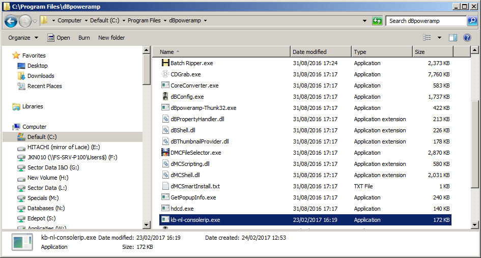

## Configure general settings

After installing, locate the *dBpoweramp* item in the Windows Start Menu, and launch the *CD Ripper* application, as shown below: 

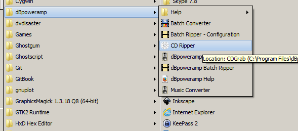

This results in the following window:

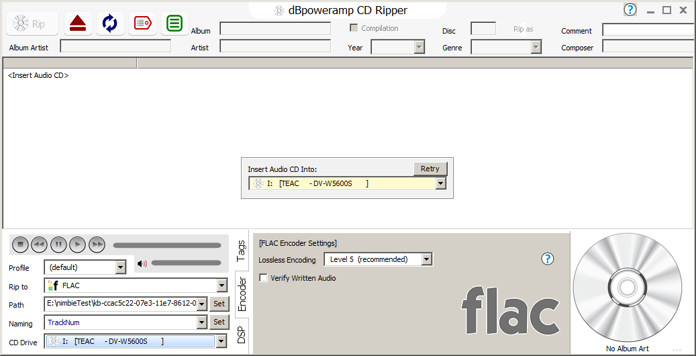

At the bottom you can configure a number of settings. Select the following:

* *Profile* - leave this at *(default)*
* *Rip to* - select either  *Wave* or *FLAC*
    * If you selected *Wave*, make sure the encoder settings (on the right) are set to *Uncompressed*, with *Bit Depth*, *Sample Rate* and *Channels* all at *as source*.
    * In case of *FLAC*, leave the *Lossless Encoding* setting at *Level 5*. (TODO: what about the *Verify Written Audio* checkbox?)
* Click on the *DSP* tab, and then on the *Add DSP / Action* button, and select *Add DSP Effect*:

    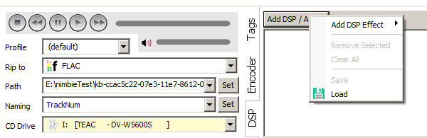
* Select *RePlayGain* from the drop-down list:

    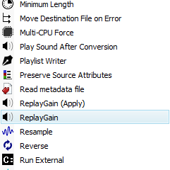
    
    (This option adds metadata on a track's loudness to the audio file. This information can be used by some audio players for volume matching / correcting. It doesn't change the audio itself.)
* *Path* - leave this at the default (whatever it may be).
* *Naming* - change the default to *TrackNum*. The effect of this is that track numbers will be used as the base names of the audio files that are written (*001.wav*, *002.wav*, and so on).
* *CD Drive* - select the CD-drive that corresponds to the Nimbie discrobot (make sure *not* to select the computer's built-in drive here; the Nimbie has a *Teac* drive so you should be able to identify it from its description.)

The following sections are largely based on dBpoweramp's *CD Ripper Setup Guide*, which is part of dBpoweramp's documentation.

## Configure ripper options

Now click on the green menu button at the top toolbar, and select *CD Ripper Options*:

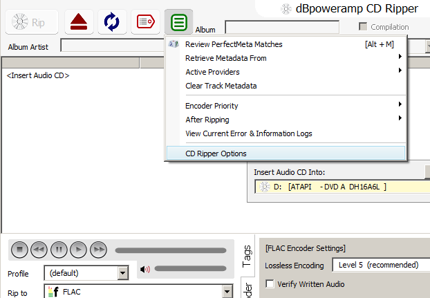

In the window that appears, set *Ripping  Method* (at the top) to *Secure (Recover Errors)*:

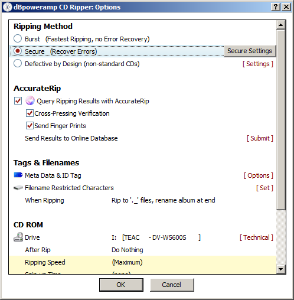

Leave the *AccurateRip* options as they are (all options checked). Next click on *Secure Settings* (to the right of *Secure (Recover Errors)*):

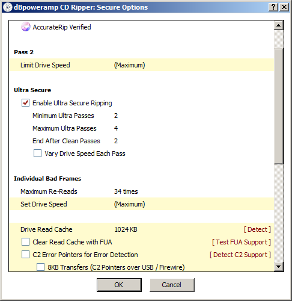

* Check *Enable Ultra Secure Ripping*
* *Minimum Ultra Passes* - set to 2 
* *Maximum Ultra Passes* - set to 4
*  *End After Clean Passes* - set to 2

Note: the above settings are valid for a drive that does not support C2 pointers. See dBpoweramp's *cd-ripper-setup-guide* on how to determine if a drive supports C2 pointers (the Nimbie's built-in drive doesn't appear to support them).

* *Drive Read Cache* - leave this at default value (1024 kB)
* *Clear Read Cache with FUA* - leave this unchecked
* *C2 Error Pointers for Error Detection* - leave this unchecked as well

## Secure Rip Abort options

Scrolling down we see the following options:

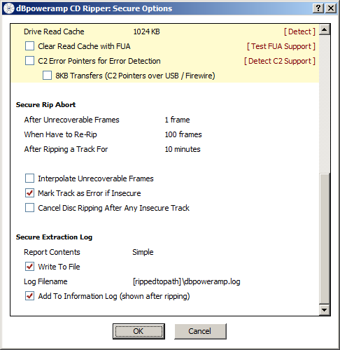

* *After Unrecoverable Frames* - set to 1 frame
* *When have to Re-Rip* - set to 100 frames
* *After Ripping a Track For* - set to 10 minutes

Also, check *Mark Track as Error if Insecure*, and check both the *Secure Extraction Log* options. Finally, click to the right of *Log Filename* and change the value to:

    [rippedtopath]\extract.log

## AccurateRip configuration

AccurateRip is a technique that performs a [Cyclic Redundancy Check](https://en.wikipedia.org/wiki/Cyclic_redundancy_check) (CRC) of ripped audio tracks against an online database. This only works correctly if the read offset of the CD-drive is known. To so, load a (preferrably well-known/popular) audio CD into the disc robot. If all goes well the following dialog will pop up:

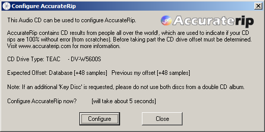

Press *Configure*. After a few seconds the result is:

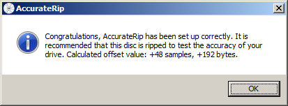

This value is automatically added to the CD-ROM settings:

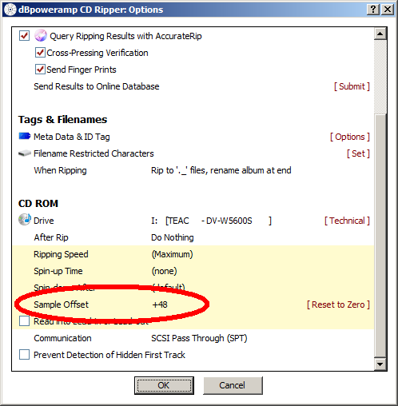

## Album art and metadata options

Go back to *CD Ripper Options* and click on *Options* next to *Meta Data & ID Tag*:

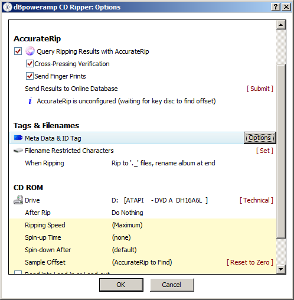

Click to the right of *Write to [output folder]*, and select *None*. This will disable the writing of any artwork JPEGs to the output folder.

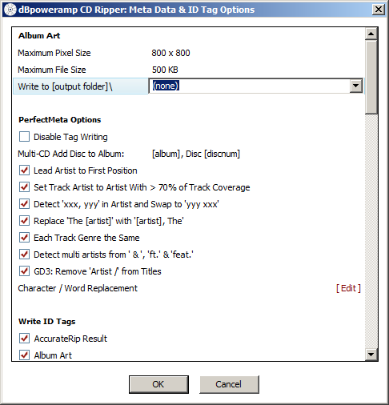

Close the *CD Ripper* application. Now dBpoweramp is configured and ready for use! 

| | |
|:--|:--|
|[Back to Setup Guide](./setupGuide.md)|[>> Next: Iromlab setup and configuration](./setupIromlab.md)|
