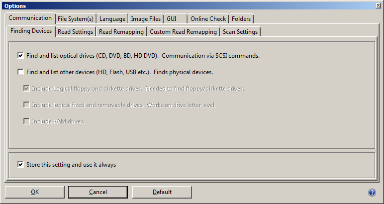
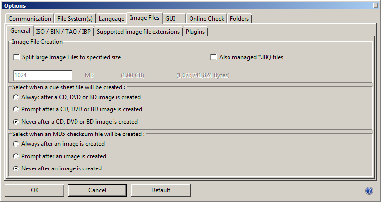
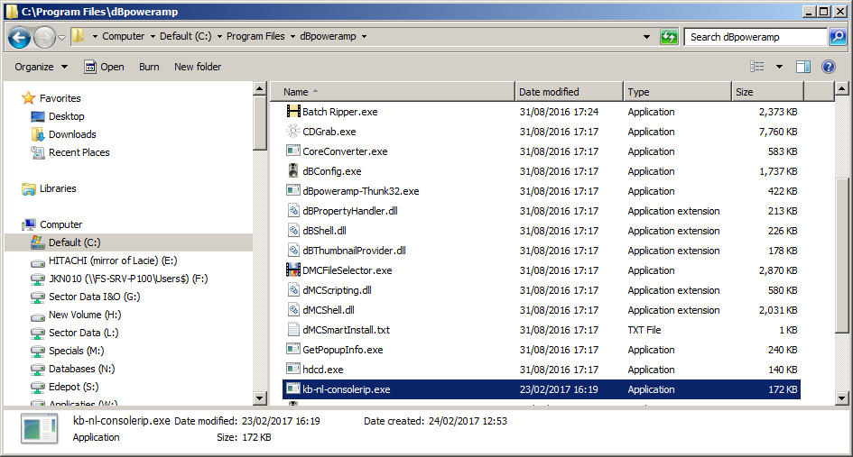
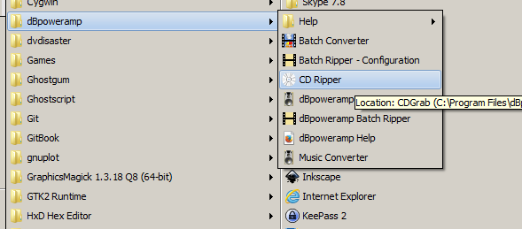
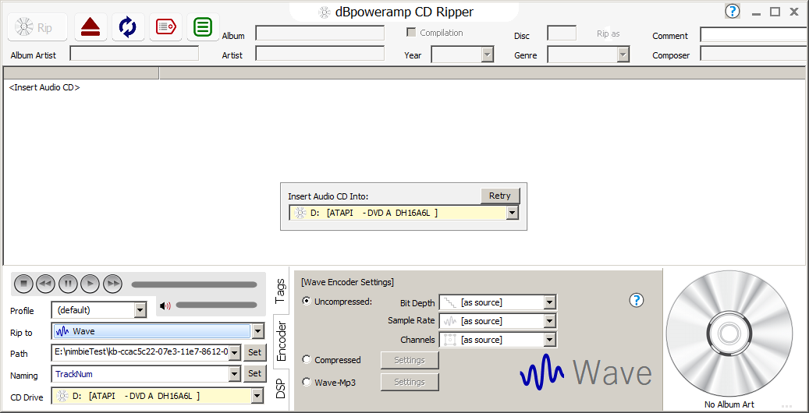
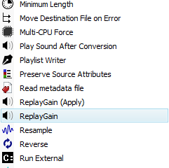

## Installation
    
    (python -m) pip install iromlab

## Platform

MS Windows only. It may be possible to adapt the software to other platforms.

## Hardware dependencies

Iromlab was created to be used in conjuction with Acronova Nimbie disc autoloaders. It has been tested with the [Nimbie NB21-DVD model](http://www.acronova.com/product/auto-blu-ray-duplicator-publisher-ripper-nimbie-usb-nb21/9/review.html). It may work with other models as well.

## Wrapped software

Iromlab wraps around a number of existing software tools:

* [IsoBuster](https://www.isobuster.com/)
* dBpoweramp, dBpoweramp Batch Ripper and Nimbie Batch Ripper Driver; all available [from the dBpoweramp website](https://www.dbpoweramp.com/batch-ripper.htm). (Note: Iromlab wraps dBpoweramp's Nimbie driver binaries to control the disc loading / unloading process.
* dBpoweramp command-line ripping tool, which provides a command-line interface to dBpoweramp's ripper. Custom tool developed specially for KB, not included in dBpoweramp default installer!
* [cd-info](https://linux.die.net/man/1/cd-info) - this tool is part of [libcdio](https://www.gnu.org/software/libcdio/),  the "GNU Compact Disc Input and Control Library".
* [shntool](http://www.etree.org/shnutils/shntool/) - used to verify the integrity of created WAVE files.
* [flac](https://xiph.org/flac/) - used to verify the integrity of created WAVE files.

Both IsoBuster and dBpoweramp require a license, and they must be installed separately. Binaries of cd-info, shntool and flac are included in the iromlab installation. When Iromlab is started for the first time, they are automatically copied to directory `iromlab/tools' in the Windows user directory.
        
## IsoBuster setup and configuration

Before using Iromlab, it is necessary to change some of IsoBuster's default settings. This is mainly to avoid pop-up dialogs during that need user input during the imaging process. You only need to do this once; the changes will persist after upgrading IsoBuster to a newer version. Below instructions apply to IsoBuster 3.9 (Professional license).

### Disable all devices that are not optical drives 

From the IsoBuster GUI, go to the *Options* menu and then select *Communication*. From there select the *Finding Devices* tab, and uncheck the "Find and list other devices (HD, Flash, USB etc)" checkbox. Also make sure that the "Store this setting and use it always" checkbox at the bottom of the tab is checked. See screenshot below:

**Why:** by default IsoBuster tries to find and access all storage devices that are connected to the machine it runs on. This triggers a Windows "User Account Control" notification popup window (which needs manual intervention) every time IsoBuster is called from Iromlab. This can be prevented by disabling all devices except optical drives.

### Disable cue sheet and checksum creation

From the IsoBuster GUI, go to *Options* / *Image Files*, and then select the *General* tab. Locate the option "select when a cue sheet file will be created", and select "Never". Likewise, set the "Select when an MD5 checksum file will be created" setting to "Never". See screenshot:

 

**Why:** cue sheets aren't needed for ISO images, and we don't want IsoBuster to prompt for anything either. Iromlab already has built-in checksum creation functionality, so we don't need IsoBuster for this.

## dBpoweramp setup and configuration

### Installation

Go to the dbPoweramp download page below:

<https://www.dbpoweramp.com/batch-ripper.htm>

Download and install the following:

* [dBPoweramp Reference](https://www.dbpoweramp.com/dmc.htm), 64-bit version (requires a license)
* [dBpoweramp Batch Ripper](https://www.dbpoweramp.com/install/dBpoweramp-Batch-Ripper.exe)
* [Nimbie Batch Ripper Driver](https://www.dbpoweramp.com/install/dBpoweramp-Batch-Ripper-Nimbie.exe)

Finally, you need to install the console ripping tool. This tool was created specifically for the KB and is *not* part of the standard dBpoweramp distribution! It must be installed in the same directory where the *CDGrab.exe* is located.  This is typically dBpoweramp's top-level installation folder (*C:\Program Files\dBpoweramp*). Drop the executable of the console riping tool (*kb-nl-consolerip.exe*) in this folder, as shown below:

### Configure ripping settings

After installing, locate the *dBpoweramp* item in the Windows Start Menu, and launch the *CD Ripper* application, as shown below: 

This results in the following window:

At the bottom you can configure a number of settings. Select the following:

* *Profile* - leave this at *(default)*
* *Rip to* - select either  *Wave* or *FLAC*
    * If you selected *Wave*, make sure the encoder settings (on the right) are set to *Uncompressed*, with *Bit Depth*, *Sample Rate* and *Channels* all at *as source*.
    * In case of *FLAC*, leave the *Lossless Encoding* setting at *Level 5*. (TODO: what about the *Verify Written Audio* checkbox?)
* Click on the *DSP* tab, and then on the *Add DSP / Action* button, and select *Add DSP Effect*:
    
* Select *RePlayGain* from the drop-down list: 
    
    (This option adds metadata on a track's loudness to the audio file. This information can be used by some audio players for volume matching / correcting. It doesn't change the audio itself)
* *Path* - leave this at whatever value the default is
* *Naming* - change the default to *TrackNum*. The effect of this is that track numbers will be used as the base names of the audio files that are written (*001.wav*, *002.wav*, and so on)
  
Then close *CD Ripper*.

## Iromlab configuration

Example:

    <?xml version="1.0"?>
    <!-- iromlab configuration file. This file MUST be in the same directory 
    as iromlab.py/ iromlab.exe! 
    -->

    <config>

    <!-- IMPORTANT notes on file paths:

    1. Do not wrap any of the file paths below in quotes, even if they contain
       spaces! (the Python os.path libs don't seem to like this!)
    2. Only use FORWARD SLASHES; backslashes can lead to unexpected behavior because
       Python can see them as escape characters.
    -->

    <!-- CD drive letter -->
    <cdDriveLetter>I</cdDriveLetter>

    <!-- root directory - this is the default search path for creating / opening batches -->
    <rootDir>E:/nimbieTest</rootDir>

    <!-- directory for storing temporary files -->
    <tempDir>C:/Temp</tempDir>

    <!-- prefix that is used to create batch names -->
    <prefixBatch>kb</prefixBatch>
    
    <!-- String that sets audio format. Permitted values: wav or flac. ONLY used for the audio verification, 
    the ripping format must be set from dBpoweramp's CD Ripper tool (GUI) defined in the Windows registry  -->
    <audioFormat>flac</audioFormat>

    <!-- maximum number of seconds that iromlab will wait while trying to load a new disc 
    this will prevent iromlab from entering an infinite loop if e.g. a disc cannot be loaded
    properly because its is badly damaged
    -->
    <secondsToTimeout>20</secondsToTimeout>

    <!-- Below items point to the locations of all executables that are wrapped by Iromlab
    -->

    <!-- location of Nimbie drivers -->
    <prebatchExe>C:/Program Files/dBpoweramp/BatchRipper/Loaders/Nimbie/Pre-Batch/Pre-Batch.exe</prebatchExe>
    <loadExe>C:/Program Files/dBpoweramp/BatchRipper/Loaders/Nimbie/Load/Load.exe</loadExe>
    <unloadExe>C:/Program Files/dBpoweramp/BatchRipper/Loaders/Nimbie/Unload/Unload.exe</unloadExe>
    <rejectExe>C:/Program Files/dBpoweramp/BatchRipper/Loaders/Nimbie/Reject/Reject.exe</rejectExe>

    <!-- location of isoBuster -->
    <isoBusterExe>C:/Program Files (x86)/Smart Projects/IsoBuster/IsoBuster.exe</isoBusterExe>

    <!-- location of dBpoweramp console ripper -->
    <dBpowerampConsoleRipExe>C:/Program Files/dBpoweramp/kb-nl-consolerip.exe</dBpowerampConsoleRipExe>

    </config>
