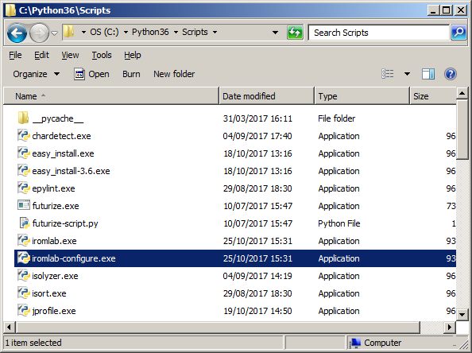
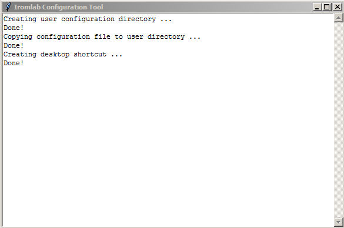
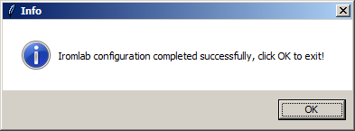
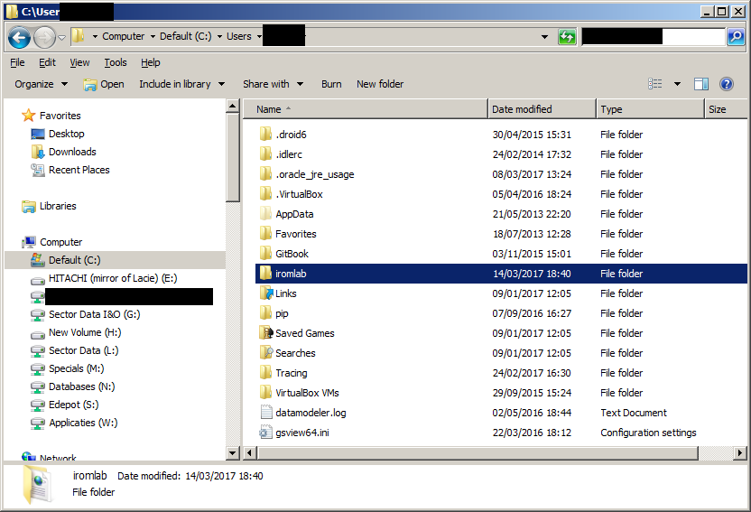
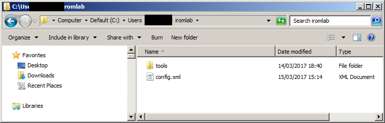
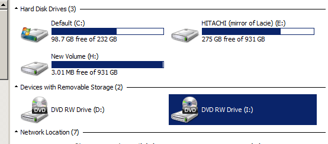

# Iromlab setup and configuration

## Installation

The recommended way to install Iromlab is to use *pip*. Installing with *pip* will also automatically install any Python packages that are used by Iromlab. On Windows systems the *pip* executable is located in the *Scripts* directory which is located under Python's top-level installation folder (e.g. *C:\Python36\Scripts*). To install Iromlab, follow the steps in either the *Global install* or *User install* subsections below.

### Global install

1. Launch a Command Prompt window. Depending on your system settings you may need to do this with Administrator privilege (right-click on the *Command Prompt* icon and the choose *Run as Administrator*).
2. Type:

      `%path-to-pip%\pip install iromlab`

    Here, replace %path-to-pip% with the actual file bpath on your system. For example:

     `C:\Python36\Scripts\pip install iromlab`

### User install

1. Launch a Command Prompt window (no admin rights required)
2. Type:

      `%path-to-pip%\pip install --user iromlab`

The above steps will install Iromlab and all required libraries. It also installs Windows binaries of the following tools:

* [cd-info](https://linux.die.net/man/1/cd-info) - this tool is part of [libcdio](https://www.gnu.org/software/libcdio/),  the "GNU Compact Disc Input and Control Library".
* [shntool](http://www.etree.org/shnutils/shntool/) - used to verify the integrity of created WAVE files.
* [flac](https://xiph.org/flac/) - used to verify the integrity of created WAVE files.

## Configuration

Before Iromlab is ready for use you need to configure it. As a first step, locate the *iromlab-configure.exe* application. In case of a global install you can find it directly under the *Scripts* directory of the *Python* installation folder:

If you did a user install, it will be somewhere in your Windows user profile (see below). The exact location depends on your local Windows configuration. As an example, in my case it is located in the folder *C:\Users\jkn010\AppData\Roaming\Python\Python36\Scripts*.

Run the configuration application by double-clicking on it. The application will create a configuration directory in your Windows user directory, copy a default configuration file to it, and create a shortcut to the main Iromlab application on the Windows Desktop [^1]. If all goes well the following window appears:

 

Click on the *OK* button on the messagebox to close the configuration application:

 

The automatically generated configuration file needs some further manual editing, which is explained in the sections below.

## Finding the configuration file

Locate the Windows User Profile directory[^2]. Open a Command Prompt window and type:

    set USERPROFILE

The output will be something like this:

    USERPROFILE=C:\Users\jkn010

If you open this location on your machine with Window Explorer you will find that it contains a folder named *iromlab*:   

Open the folder, and you will see this:

## Editing the configuration file

Now open the configuration file *config.xml* in a text editor (e.g. Notepad), or alternatively use a dedicated XML editor. Carefully go through all the variables (which are defined as XML elements), and modify them if necessary. Here is an explanation of all variables.

### cdDriveLetter

This is the drive letter that is assigned to the Nimbie discrobot's built-in optical drive. If you don't know what value to use, just switch on the Nimbie. Then open a Windows Explorer window, click on *Computer* and then look under *Devices with Removable Storage*. You will see something like this: 

In this case we have 2 CD drives, where *D* is the internal drive, and *I* is the Nimbie. So we enter this in the configuration file like this:

    <cdDriveLetter>I</cdDriveLetter>

(Note: do *not* add a colon to the drive letter).

### rootDir

This defines the root directory where Iromlab will write its data. Iromlab output is organised into *batches*, and each batch is written to *rootDir*. Make sure to pick an existing directory with plenty of space. Example:

    <rootDir>E:\nimbieTest</rootDir>

### tempDir

This is the directory that is used for writing temporary files. It must be an existing directory; in most cases you can use the default value (*C:\Temp*). Example:

    <tempDir>C:\Temp</tempDir>

### prefixBatch

This is a text prefix that is added to the automatically-generated batch names:

    <prefixBatch>kb</prefixBatch>

### audioFormat

This defines the audio ripping format. Permitted values are  *wav* or *flac*. This setting is *only* used for the audio verification component, the ripping format must be set from dBpoweramp's CD Ripper tool, which is explained in the [dBpoweramp setup and configuration](./setupDbpoweramp.md) instructions. You have to make sure that both settings are consistent, as unexpected behaviour may occur otherwise. Example: 

    <audioFormat>flac</audioFormat>

### secondsToTimeout

Defines the maximum number of seconds that Iromlab will wait while trying to load a new disc. This will prevent iromlab from entering an infinite loop if e.g. a disc cannot be loaded properly because its is badly damaged.

    <secondsToTimeout>20</secondsToTimeout>

### socketHost

Defines the host address that is used if the socket API is enabled (see below). Use 127.0.0.1 for localhost:

    <socketHost>127.0.0.1</socketHost>

### socketPort

Defines the port that is used if the socket API is enabled (see below):

    <socketPort>65432</socketPor

### enablePPNLookup

Flag that controls whether PPN lookup is enabled. If set to *True*, the Iromlab interface contains a widget for entering a *PPN* identifier. After submitting, Iromlab then performs a lookup on the PPN in the KB catalogue, and automatically extracts the title of the corresponding entry (which is then added to the batch manifest). If set to *False*, the Iromlab interface contains a widget in which an operator can manually enter a *Title* string; the entered value is written to the batch manifest. In this case no PPN lookup is performed, and the PPN-value in the batch manifest will be a zero-length string.

Allowed values:

    <enablePPNLookup>True</enablePPNLookup>

and:

    <enablePPNLookup>False</enablePPNLookup>

### startOnFinalize

This is a flag that -if set to *True*- delays the processing of any discs until the operator finalizes the batch (disabled by default):

    <startOnFinalize>False</startOnFinalize>

### enableSocketAPI

This is a flag that -if set to *True*- enables Iromlab to pick up Title and PPN info from a client application through a socket interface (disabled by default):

    <enableSocketAPI>False</enableSocketAPI>

### reportFormatString

Defines the format of the output report that is generated  by IsoBuster. The format is described in the [IsoBuster documentation](https://www.isobuster.com/tips/build_custom_lists_and_reports_via_gui_or_cmd). By default reports are generated in [Digital Forensics XML (DFXML)](http://www.forensicswiki.org/wiki/Category:Digital_Forensics_XML) format. Note that the IsoBuster format string must be wrapped inside a [CDATA section](https://en.wikipedia.org/wiki/CDATA).
    
### Location of disc robot drivers

The following four settings define the full file paths to the driver programs for the disc robot. These are all located in dBpoweramp's BatchRipper folder (installation instructions for dBpoweramp and the drivers can be found [here](./setupDbpoweramp.md)). Example:

    <prebatchExe>C:\Program Files\dBpoweramp\BatchRipper\Loaders\Nimbie\Pre-Batch\Pre-Batch.exe</prebatchExe>
    <loadExe>C:\Program Files\dBpoweramp\BatchRipper\Loaders\Nimbie\Load\Load.exe</loadExe>
    <unloadExe>C:\Program Files\dBpoweramp\BatchRipper\Loaders\Nimbie\Unload\Unload.exe</unloadExe>
    <rejectExe>C:\Program Files\dBpoweramp\BatchRipper\Loaders\Nimbie\Reject\Reject.exe</rejectExe>

### isoBusterExe

Location of isoBuster (installation instructions for Isobuster can be found [here](./setupIsobuster.md)). Example:

    <isoBusterExe>C:\Program Files (x86)\Smart Projects\IsoBuster\IsoBuster.exe</isoBusterExe>

### dBpowerampConsoleRipExe

Location of the dBpoweramp console ripper tool (note: not included with dBpoweramp!): 

    <dBpowerampConsoleRipExe>C:\Program Files\dBpoweramp\kb-nl-consolerip.exe</dBpowerampConsoleRipExe>

If all went well, Iromlab will now be ready to use!

| |
|:--|
|[Back to Setup Guide](./setupGuide.md)|

[^1]: This will *not* overwrite any pre-existing configuration files.

[^2]: To be more precise: the profile of the user that installed Iromlab (in case of multiple user profiles)