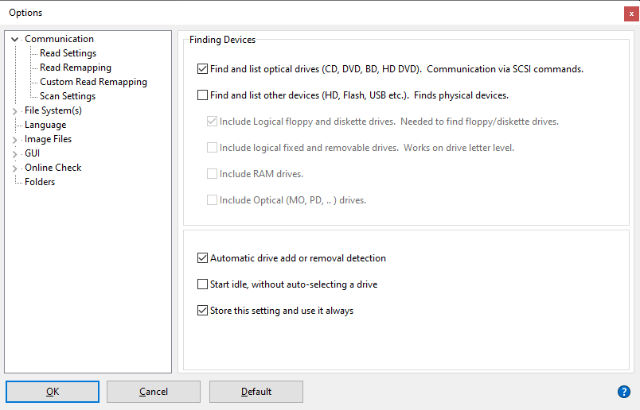

# Isobuster setup and configuration

## Installation

Iromlab requires Isobuster 4.1 or more (older versions don't support DFXML reports). Go to the Isobuster download page below:

<https://www.isobuster.com/download.php>

Then run the installer (this requires administrator privilges).

## Launching IsoBuster as non-admin user

(Note: the steps described in this section may or may not be necessary, depending on your local Windows configuration.) 

By default launching IsoBuster activates a [Windows User Account](https://en.wikipedia.org/wiki/User_Account_Control) (UAC) dialog that asks you to enter you local administrator user name and password. However, depending on your local Windows configuration, any registration credentials and configuration settings that are entered in this 'elevated' mode may not be accessible when IsoBuster is run as a 'regular' user. So before going any further we must enforce that IsoBuster is launched as a regular user. Probably the easiest way to do this:

* Locate the IsoBuster launcher in your Windows menu, and pin it to your task bar or desktop.
* Then right-click on the pinned launcher, and select *Properties*.
* Click inside the *Target* field at the top. This contains the full path to the IsoBuster executable. At the very end of this field (after the closing quotation mark!), add ` /nodrives` (so: one space, followed by the `/nodrives` text string).
- Click OK.

Now launch IsoBuster by clicking on the modified launcher. If all goes well IsoBuster now starts up without showing any UAC dialogs.

## Registration

When Isobuster is run for the first time, a registration dialog appears. Here you need to enter the appropriate e-mail address, registration ID and license key (which are in the e-mail you received after buying your license).

## Configuration

Before using Iromlab, it is necessary to change some of IsoBuster's default settings. This is mainly to avoid pop-up dialogs during that need user input during the imaging process. You only need to do this once; the changes will persist after upgrading IsoBuster to a newer version. Below instructions apply to (and were tested with) IsoBuster 4.5 (Professional license).

## Disable all devices that are not optical drives

From the IsoBuster GUI, go to the *Options* menu and then select *Communication*. From there select *Finding Devices*, and uncheck the "Find and list other devices (HD, Flash, USB etc)" checkbox. Also make sure that the "Store this setting and use it always" checkbox at the bottom of the tab is checked. See screenshot below:

**Why:** by default IsoBuster tries to find and access all storage devices that are connected to the machine it runs on. This triggers a Windows "User Account Control" notification popup window (which needs manual intervention) every time IsoBuster is called from Iromlab. This can be prevented by disabling all devices except optical drives.

## Disable cue sheet and checksum creation

<!-- Might reconsider disabling cuesheets in future; in that case see alternative screenshot! -->

From the *Options* dialog, select *Image Files*. Locate the option "select when a cue sheet file will be created", and select "Never". Likewise, set the "Select when an MD5 checksum file will be created" setting to "Never". See screenshot:

**Why:** cue sheets aren't needed for ISO images, and we don't want IsoBuster to prompt for anything either. Iromlab already has built-in checksum creation functionality, so we don't need IsoBuster for this.

After these changes Isobuster will work correctly when called from Iromlab.

| | |
|:--|:--|
|[Back to Setup Guide](./setupGuide.md)|[>> Next: dBpoweramp setup and configuration](./setupDbpoweramp.md)|
