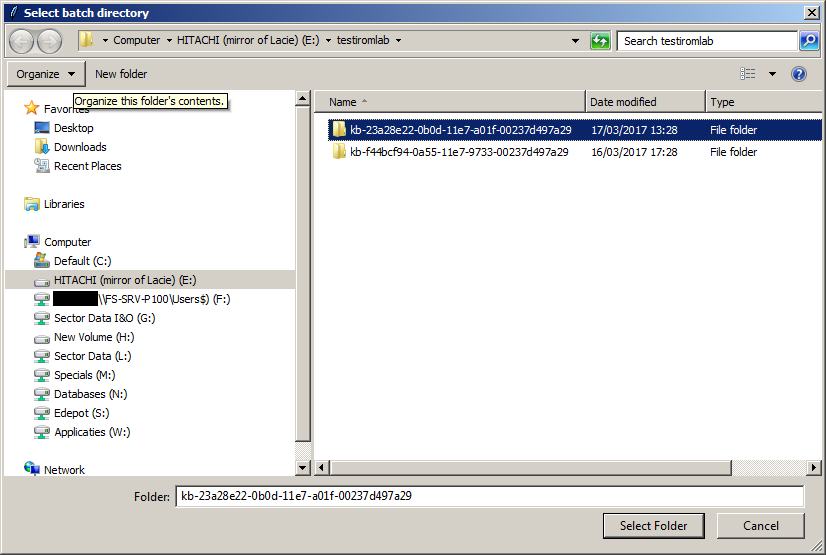
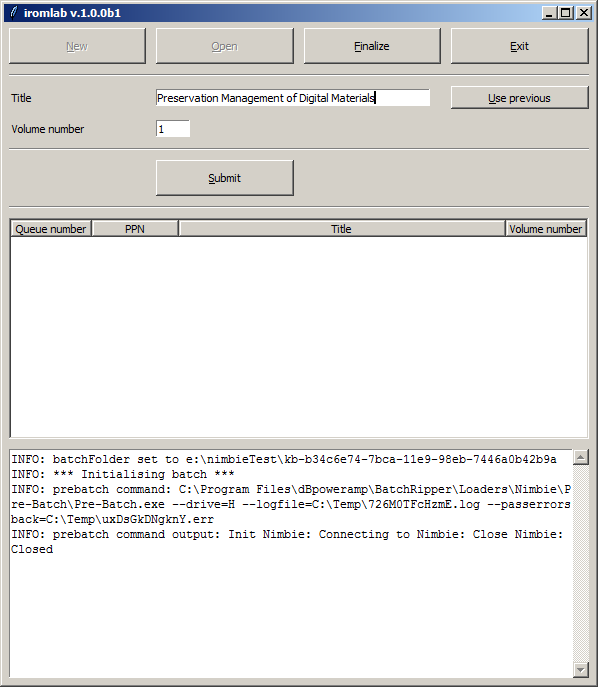

# Iromlab User Guide

This User Guide assumes that Iromlab and its dependencies have been installed and configure. If this is not the case, consult the [Setup Guide](./setupGuide.md) first.

## Getting started

Before launching Iromlab, switch on the Nimbie disc robot and wait about 30 seconds for it to initialise (if you don't do this Iromlab will not recognise the Nimbie's optical drive, and exit with an error message). Then double-click on Iromlab's Desktop icon. If all goes well the following window appears:

Upon startup, you have three options:

* Create a *New* batch (see below)
* *Open* an existing batch
* *Exit* Iromlab

## Create a batch

Let's create a new batch. Click on the top-left *New* button. Iromlab will respond with:

Now press *OK*. The Iromlab window now changes to: 

The console widget at the bottom shows the full path to the newly created batch folder. It also shows some messages that are related to the initialization of the batch. (These messages are also written to a log file. We'll get to that later.)

### Naming of batches

The batch name is automatically generated. It contains of a prefix (defined by the *prefixBatch* variable in Iromlab's configuration file), followed by a [Universally Unique Identifier](https://en.wikipedia.org/wiki/Universally_unique_identifier), which is based on the hardware address and the current time ("version 1" UUID). This ensures that batch names are always unique if Iromlab is run on different machines in parallel.

## Process a disc

Now let's process a disc. We'll assume here that the *enablePPNLookup* flag in the configuration file is set to *True*: the disc is part of the KB collection, and has a known PPN identifier associated with it. In this example we'll assume we're using the CD-ROM that is supplemental to the book "(Bijna) alles over bestandsformaten". Its catalogue record can be found here:

<http://opc4.kb.nl/DB=1/PPN?PPN=155658050>

We start by entering the required fields:

* *PPN* is the PPN that is associated with the carrier (here: *155658050*).
* *Volume number* is *1* (the assignment of volume numbers and how they are related to carrier type is explained further below).
* *Carrier type* is *cd-rom*.

Now press the *Submit* button. Iromlab now tries to look up up the entered *PPN* in the catalogue. If a matching record is found it will display the corresponding title, and ask for confirmation:

If the displayed title doesn't match your disc (because you accidentally entered the wrong *PPN*), you can press *No*, enter the (correct) *PPN* and then pres *Submit* again. Once the title is as expected, press *OK*. Another dialog pops up:

Now load the first disc in the Nimbie loader by placing it on top of the three white loader wheels. After that, press *OK*.

After some seconds the Nimbie starts loading the disc. The processing of each disc involves the following steps:

1. Load the disc.
2. Analyze the disc with [cd-info](https://linux.die.net/man/1/cd-info) to determine whether it contains data, audio, or both
3. Extract the contents of the disc. In this case we have a cd-rom that only contains a data track, which is extracted to an ISO image with Isobuster. Beware that Isobuster will launch in a separate window (the window minimizes briefly after Isobuster starts, and it automatically disappears after Isobuster is finished). Audio tracks are ripped to WAV or FLAC using dBpoweramp.
4. Verify the ISO image with Isolyzer; verify audio tracks with Shntool or flac (depending on the format that was set in the configuration)
5. Compute SHA-512 checksums for all generated files (ISO images, audio files)
6. If no errors occurred in the above steps, unload the disc. In case of errors, reject it. Rejected discs will come out underneath the Nimbie unit (unlike unloaded discs, which exit through the slot on the front). 
7. Finally, an entry is added to the *batch manifest* (explained further below).

## Process more discs

In order to process additional discs, simply repeat the steps from the previous section for each disc. For multi-volume PPNs you can use the *Use previous* and *Increase previous* buttons:

* The *Use previous* button next to the *PPN* widget lets you re-use the PPN value from the previous disc.
* Likewise, the *Increase previous* button next to the *Volume number* widget increases the previously entered volume number by 1.

You can add new discs while the Nimbie is busy processing a disc; in fact you can keep adding discs until the disc loader is full (which is at 30 discs by default, and 100 if the extension rods are used). For each disc, Iromlab creates a *job file* that contains the fields that were entered by the operator (PPN, volume number, carrier type). The job file is then placed in a ["first in first out"](https://en.wikipedia.org/wiki/FIFO_(computing_and_electronics)) (FIFO)  queue. The job files are physically written to the *jobs* directory inside the batch. 

**Important:** you should *never* modify any of the files inside the *jobs* folder in *any* way. This includes opening them in a text editor and re-saving them. This is because Iromlab uses the timestamps of the job files (their creation times) to establish the processing order. Modifying a job file will change its timestamp, and mess up the processing order as a result.

## Finalize a batch

When you're done entering new discs, press the *Finalize* button at the top of the Iromlab window. This will trigger a confirmation dialog:

Then press *Yes*. Iromlab now adds a special "End Of Batch" job to the queue. The *Submit* button will now be deactivated, you you won't be able to add new  discs from this point onward: 

Meanwhile, Iromlab will continue processing the remaining discs / jobs that are in the queue. After the last disc is finished, you will see:

Now press *OK*, and Iromlab will close.

## Exiting Iromlab

If you press the *Exit* while a batch is being processed, Iromlab will finish the processing of the current disc. It will then close. The batch can be finished later by opening it (see below).

## Opening an existing batch

After pressing the *Open* button upon startup you will see a file dialog that shows all batch folders in Iromlab's root directory (*rootDir*):

This allows you to continue a batch that was interrupted with the *Exit* command.

## All discs of a PPN must be in same batch

All discs that belong to one *PPN* must *always* be in the same batch. This is because the batches must be processed into ingest-ready Submission Information Packages (SIPs) further down the processing chain, and all discs that are part of a *PPN* are grouped into one SIP. This doesn't work if a *PPN* is spread across multiple batches.  

## How to avoid synchronisation errors

It is absolutely vital that Iromlab's job queue and the "physical" queue (i.e. the stack of discs in the Nimbie loader) are perfectly synchronised at all times. For example, if an operator mistakenly submits a disc entry to the job queue without loading an actual disc, the result will be an offset between the batch-level metadata (the batch manifest) and the actual disc images/rips. To minimise the risk of such errors, make sure to:

1. Perform all steps that are needed to process a disc in a fixed order (i.e. the order suggested above).
2. Most importantly, *only* load the disc once Iromlab displays the *Load disc* dialog.
3. Pay special attention to only load one disc at a time (look out for discs that are 'stuck' together)

It's probably impossible to eliminate synchronisation errors altogether. Since batches with synchronisation errors have to be re-processed from scratch, it is a good idea to limit the size of a batch somewhat. For example, in case of a synchronisation error in a batch with hundreds of discs that took a whole day to create, a whole day's work will have to be re-done. For a smaller batch that only took two hours, much less time will be lost.  

## Processing discs that are not part of the KB collection

For discs that are not part of the KB collection, it is recommended to set the *enablePPNLookup* flag in Iromlab's configuration file to *False*:

    <enablePPNLookup>False</enablePPNLookup>

With this setting, the *PPN* widget in the Iromlab interface is replaced by a *Title* entry widget. You can use it to manually enter a title (or other description) for each disc:

## The batch manifest

The batch manifest is a comma-delimited text file named *manifest.csv* which is located at the root of a batch. It contains all information that is needed to process the batch into ingest-ready Submission Information Packages further down the processing chain (using [omSipCreator](https://github.com/KBNLresearch/omSipCreator)). For each processed disc, it contains the following fields:

1. *jobID* - internal carrier-level identifier. The image file(s) of this disc are stored in an eponymous directory within the batch.
2. *PPN* - identifier of the physical item in the KB Collection to which this disc belongs. For the KB case this is the PPN identifier in the KB catalogue (GGC). If *enablePPNLookup* is set to *False*, it will be an empty (zero-length) string.
3. *volumeNo* - for intellectual entities that span multiple discs, this defines the volume number (1 for single-volume items). Values must be unique within each *carrierType* (see below)  
4. *carrierType* - code that specifies the disc type. Currently the following values are permitted:
    - cd-rom
    - dvd-rom
    - cd-audio
    - dvd-video
5. *title* - text string with the title of the disc (or the publication it is part of). If *enablePPNLookup* is *True* the title field is extracted from the KB catalogue record. If *enablePPNLookup* is *False* the manually entered *Title* value is used.
6. *volumeID* - text string, extracted from Primary Volume descriptor, empty if cd-audio.
7. *success* - True/False flag that indicates status of *iromlab*'s imaging process. 
8. *containsAudio* - True/False flag that indicates the disc contains audio tracks (detected by cd-info)   
9. *containsData* - True/False flag that indicates the disc contains data tracks (detected by cd-info)
9. *cdExtra* - True/False flag that indicates if the disc is [*cd-Extra*](https://en.wikipedia.org/wiki/Blue_Book_(CD_standard)) (Blue Book) disc (detected by cd-info)

The first line of the file contains column headers.

Example:

    jobID,PPN,volumeNo,carrierType,title,volumeID,success,containsAudio,containsData,cdExtra
    8a7ea9f0-0a65-11e7-b41c-00237d497a29,155658050,1,cd-rom,(Bijna) alles over bestandsformaten,Handbook,True,False,True,False

## The log file

Each batch contains a log file *batch.log*. It contains detailed information about the detection, imaging and ripping subprocesses (including the exit status and output of wrapped tools). If a disc gets rejected or if anything unexpected happens, checking the batch log will help you identify the problem.

<!-- TODO: link to some example log files -->

## Created files for each disc

For each disc, Iromlab creates a folder in the batch folder. The name of each folder is (again) a [Universally Unique Identifier](https://en.wikipedia.org/wiki/Universally_unique_identifier), which is based on the hardware address and the current time ("version 1" UUID). Each of these folders contain the following files:

* *cd-info.log* - output of the cd-info tool. Contains general information about the disc, including its sector layout.
* *xxx.iso* - ISO image (only if disc contains a data session).
* *isobuster.log* - log file with Isobuster log error code; see *Log Error* section in the [Isobuster documentation](https://www.isobuster.com/help/use_of_command_line_parameters) (only if disc contains a data session).
* *isobuster-report.xml* - report file in [Digital Forensics XML](https://en.wikipedia.org/wiki/Digital_Forensics_XML) format; includes listing of all files on the disc (only if disc contains a data session).
* *xxx.wav* / *xxx.flac* - audio files in WAV or FLAC format (only if disc contains audio).
* *dbpoweramp.log* - dbpoweramp log file (only if disc contains audio).
* *checksums.sha512* - checksum file with SHA-512 hashes of all the above files in this directory.

## How to use the Volume number and Carrier type fields

The correct use of the *Volume number* field in the Iromlab interface needs some explaining. First of, it is important to understand that one *PPN* (catalogue entry) can contain multiple discs. Moreover, there can be multiple disc *types* inside one *PPN*. Here's an example:

In this case the *PPN* contains:

1. one set of 3 audio CDs
2. one set of 2 DVDs

Now, the *Volume number* values apply to discs *within each of these sets*. So for each *Carrier type* we start numbering at 1 again. In this case:

|Disc|Volume number|Carrier type|
|:--|:--|:--|
|First audio CD|1|cd-audio|
|Second audio CD|2|cd-audio|
|Third audio CD|3|cd-audio|
|First DVD|1|dvd-rom|
|Second DVD|2|dvd-rom|

### Impact of data entry errors
 
The selected value of *Carrier type* does *not* influence the imaging or ripping process; it is only used to describe the disc at the metadata level. For example, suppose an operator accidentally selects *cd-audio* for a *cd-rom*, Iromlab automatically detects that the disc contains data, and the data are then correctly extracted to an ISO image. Verification of the batch with the [omSipCreator](https://github.com/KBNLresearch/omSipCreator) tool will result in an error mesage in this case, as it checks the consistency between the values of *carrierType* and the *containsAudio* and *containsData* flags for each entry. OmSipCreator also checks for duplicate *Volume number* values within each *Carrier type* set.

## Troubleshooting

### Iromlab shows "*X* is not a valid optical drive" error on startup

Example:

Possible causes:

* Disc robot is not switched on.
* Iromlab was launched too quickly after switching on the disc robot (typically it takes about 30 seconds for the drive to be recognised). **Solution:** wait a few seconds and then lauch Iromlab again.
* *cdDriveLetter* in configuration file is not configured properly (see [setup and configuration guide](./setupIromlab.md)).
* If you connected a removable storage device (e.g. a USB-connected hard disk) before switching on the disc robot, that device may be mapped to *cdDriveLetter*, and the disc robot will be mapped to another value. **Solution:** disconnect the storage device, and log out of your Windows session. Then log in again, switch on the disc robot and then launch Iromlab. 

<!-- You can inspect the batch folder with Windows Explorer:

The folder contains the following items:

- file *manifest.csv* - a comma-delimited text file that will contain basic metadata about each carrier 
- file *batch.log* - a log file with detailed information on all sub-processes that are run as part of Iromlab
- folder *jobs* -->

## Annex: How to spot synchronisation errors

It is difficult to identify synchronisation errors in a batch automatically. However, the *title* and *volumeID* fields in the batch manifest may give some clues. The *title* field contains the title as extracted from the catalogue. For discs that contain data, the *volumeID* field is a descriptive text string that is extracted from the ISO image. Use of the *volumeID* field is not mandatory, and it's essentially up to the creator of a CD-ROM how this field is filled (if at all). Nevertheless, the value of *volumeID* is often derived from the title (though not always in a predictable way). By way of illustration, the table below lists 20 discs from the KB collection with their corresponding *volumeID* values:  

|Title|volumeID|
|:--|:--|
|[Birds of tropical Asia : sounds and sights ](http://opc4.kb.nl/DB=1/PPN?PPN=236599380)|BIRDSTROPASIA2|
|[(Bijna) alles over bestandsformaten](http://opc4.kb.nl/DB=1/PPN?PPN=155658050)|CD001|
|[Suske en Wiske stripmaker](http://opc4.kb.nl/DB=1/PPN?PPN=173949940)|SWSTRIP|
|[Ik zie, ik zie, wat jij niet ziet in het spookhuis](http://opc4.kb.nl/DB=1/PPN?PPN=227760425)|SPOOKHUIS|
|[De bewaarmachine](http://opc4.kb.nl/DB=1/PPN?PPN=156414058)|BEWAARMACHINE_PC|
| [Citydisc : 21 steden op CD-ROM](http://opc4.kb.nl/DB=1/PPN?PPN=142182516)|CITYDISC|
|[Encyclopædia Britannica](http://opc4.kb.nl/DB=1/PPN?PPN=16385100X)|BCD97_1|
|[Besturingssystemen](http://opc4.kb.nl/DB=1/PPN?PPN=341568554)|BESTURINGSSYST|
|[Der totalitäre Staat](http://opc4.kb.nl/DB=1/PPN?PPN=322140315)|DISK|
|[Fotoview Den Haag](http://opc4.kb.nl/DB=1/PPN?PPN=163359881)|FOTOVIEW|
|[CD recensierom : recensies over CD-ROMS](http://opc4.kb.nl/DB=1/PPN?PPN=204097509)|CDRECENSIEROM|
|[Nieuw Nederlands. Bovenbouw. Diagnostische toetsen](http://opc4.kb.nl/DB=1/PPN?PPN=216401070)|DTSA_NIEVWO|
|[De feestcommissie in Marokko](http://opc4.kb.nl/DB=1/PPN?PPN=298147963)|DE_FEESTCOMMISSIE|
|[Fotografische atlas van de praktische anatomie](http://opc4.kb.nl/DB=1/PPN?PPN=322953405)|SPRINGER|
|[Sprekend verleden. SV-digitaal](http://opc4.kb.nl/DB=1/PPN?PPN=314073884)|DIGITAAL|
|[Klikbijbel](http://opc4.kb.nl/DB=1/PPN?PPN=229687598)|KLIKBIJBEL|
|[De geologie van de provincie Utrecht ](http://opc4.kb.nl/DB=1/PPN?PPN=24418898X)|UTRECHT|
|[Bas gaat digi-taal](http://opc4.kb.nl/DB=1/PPN?PPN=234866780)|BAS_DEEL_I|
|[De junior Bos(a)tlas](http://opc4.kb.nl/DB=1/PPN?PPN=181492121)|JTWORLD|
|[Kamp Vught in de klas](http://opc4.kb.nl/DB=1/PPN?PPN=331115417)|KAMP_VUGHT_IN_DE_KLAS|

The correspondence between the *volumeID* and *title* fields is clear for 13 of these titles. For the remaining 7 the correspondence is less obvious or altogether absent. 

This means that it may be possible to detect synchronisation errors by visually inspecting the *title* and *volumeID* fields of the final (say, 10) entries that were written to the batch manifest. If the *volumeID* fields appears to be related *title* fields of preceding or succeeding entries, this is an indication that there may be synchronisation errors.