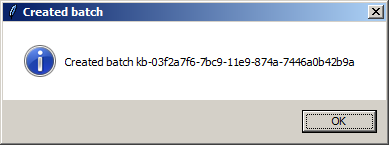
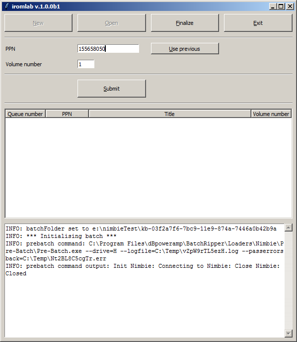

# Iromlab User Guide

This User Guide assumes that Iromlab and its dependencies have been installed and configure. If this is not the case, consult the [Setup Guide](./setupGuide.md) first.

## Getting started

Before launching Iromlab, switch on the Nimbie disc robot and wait about 30 seconds for it to initialise (if you don't do this Iromlab will not recognise the Nimbie's optical drive, and exit with an error message). Then double-click on Iromlab's Desktop icon. If all goes well the following window appears:

## Create a batch

Let's create a new batch. Click on the top-left *New* button. Iromlab will respond with:

Now press *OK*. The Iromlab window now changes to: 

The console widget at the bottom shows the full path to the newly created batch folder. It also shows some messages that are related to the initialization of the batch 

Note: the messages that you see in the console window are also written to a log file. We'll get to that later.

## Process a disc

Now let's process a disc. We'll assume here that the disc you're using is part of the KB collection, and has a known PPN identifier associated with it. In this example we'll assume we're using the CD-ROM that is supplemental to the book "(Bijna) alles over bestandsformaten". Its catalogue record can be found here:

<http://opc4.kb.nl/DB=1/PPN?PPN=155658050>

We start by entering the required fields:

* *PPN* is the PPN that is associated with the carrier (here: *155658050*).
* *Volume number* is *1* (the assignment of volume numbers and how they are related to carrier type is explained further below).
* *Carrier type* is *cd-rom*.

Now press the *Submit* button. Iromlab now tries to look up up the entered *PPN* in the catalogue. If a matching record is found it will display the corresponding title, and ask for confirmation:

If the displayed title doesn't match your disc (because you accidentally entered the wrong *PPN*), you can press *No*, enter the (correct) *PPN* and then pres *Submit* again. Once the title is as expected, press *OK*. Another dialog pops up:

Now load the first disc in the Nimbie loader by placing it on top of the three white loader wheels. After that, press *OK*.

After some seconds the Nimbie starts loading the disc. The processing of each disc involves the following steps:

1. Load the disc.
2. Analyze the disc with [cd-info](https://linux.die.net/man/1/cd-info) to determine whether it contains data, audio, or both
3. Extract the contents of the disc. In this case we have a cd-rom that only contains a data track, which is extracted to an ISO image with Isobuster. Beware that Isobuster will launch in a separate window (the window automatically disappears after Isobuster is finished).
4. Verify the ISO image with Isolyzer; verify audio tracks with Shntool or flac (depending on the format that was set in the configuration)
5. If no errors occurred in the above steps, unload the disc. In case of errors, reject it. Rejected discs will come out underneath the Nimbie unit (unlike unloaded discs, which exit through the slot on the front). 
6. Finally, an entry is added to the *batch manifest*. This is a comma-delimited text file named *manifest.csv* which is located at the root of a batch.

## Batch manifest

For each processed disc, the batch manifest contains the following fields:

1. *jobID* - internal carrier-level identifier. The image file(s) of this carrier are stored in an eponymous directory within the batch.
2. *PPN*
3. *volumeNo* - for intellectual entities that span multiple carriers, this defines the volume number (1 for single-volume items). Values must be unique within each *carrierType* (see below)  
4. *carrierType* - code that specifies the carrier type. Currently the following values are permitted:
    - cd-rom
    - dvd-rom
    - cd-audio
    - dvd-video
5. *title* - text string with the title of the carrier (or the publication is is part of).
6. *volumeID* - text string, extracted from Primary Volume descriptor, empty if cd-audio.
7. *success* - True/False flag that indicates status of *iromlab*'s imaging process. 
8. *containsAudio* - True/False flag that indicates the carrier contains audio tracks (detected by cd-info)   
9. *containsData* - True/False flag that indicates the carrier contains data tracks (detected by cd-info)

Example:

    jobID,PPN,volumeNo,carrierType,title,volumeID,success,containsAudio,containsData
    8a7ea9f0-0a65-11e7-b41c-00237d497a29,155658050,1,cd-rom,(Bijna) alles over bestandsformaten,Handbook,True,False,True

## Processing more discs

In order to process additional discs, simply repeat the steps from the previous section for each disc. You can add new discs while the Nimbie is busy processing a disc; in fact you can keep adding discs until the disc loader is full (which is at 30 discs by default, and 100 if the extension rods are used). For each disc, Iromlab creates a *job file* that contains the fields that were entered by the operator (PPN, volume number, carrier type). The job file is then placed in ["first in first out"](https://en.wikipedia.org/wiki/FIFO_(computing_and_electronics)) (FIFO)  queue. Since the stack of discs in the Nimbie loader are processed in FIFO order as well, this should -at least in theory- ensure that each entry in the batch  This allows Iromlab to keep track of   

 

## How to use the Volume number and Carrier type fields

## Troubleshooting

<!-- You can inspect the batch folder with Windows Explorer:

The folder contains the following items:

- file *manifest.csv* - a comma-delimited text file that will contain basic metadata about each carrier 
- file *batch.log* - a log file with detailed information on all sub-processes that are run as part of Iromlab
- folder *jobs* -->

