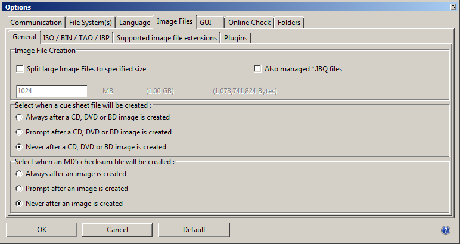

## Dependencies

* [requests](https://pypi.python.org/pypi/requests). Installation:

        (python -m ) pip install requests
    
* [wmi](https://pypi.python.org/pypi/WMI/). Installation:

        (python -m) pip install wmi

* [tkInter](https://wiki.python.org/moin/TkInter). Installation: see [here](http://tkinter.unpythonic.net/wiki/How_to_install_Tkinter) (apparently tkInter is included by default in the Python 2.7 / 3.x Windows installers).
        
## Contributors

Written by Johan van der Knijff, except *sru.py* which was adapted from the [KB Python API](https://github.com/KBNLresearch/KB-python-API) which is written by WillemJan Faber. The KB Python API is released under the GNU GENERAL PUBLIC LICENSE.

## IsoBuster configuration

Before using Iromlab, it is necessary to change some of IsoBuster's default settings. This is mainly to avoid pop-up dialogs during that need user input during the imaging process. You only need to do this once; the changes will persist after upgrading IsoBuster to a newer version. Below instructions apply to IsoBuster 3.9 (Professional license).

### Disable all devices that are not optical drives 

From the IsoBuster GUI, go to the *Options* menu and then select *Communication*. From there select the *Finding Devices* tab, and uncheck the "Find and list other devices (HD, Flash, USB etc)" checkbox. Also make sure that the "Store this setting and use it always" checkbox at the bottom of the tab is checked. See screenshot below:

**Why:** by default IsoBuster tries to find and access all storage devices that are connected to the machine it runs on. This triggers a Windows "User Account Control" notification popup window (which needs manual intervention) every time IsoBuster is called from Iromlab. This can be prevented by disabling all devices except optical drives.

### Disable cue sheet and checksum creation

From the IsoBuster GUI, go to *Options* / *Image Files*, and then select the *General* tab. Locate the option "select when a cue sheet file will be created", and select "Never". Likewise, set the "Select when an MD5 checksum file will be created" setting to "Never". See screenshot:

 

**Why:** cue sheets aren't needed for ISO images, and we don't want IsoBuster to prompt for anything either. Iromlab already has built-in checksum creation functionality, so we don't need IsoBuster for this.

 

